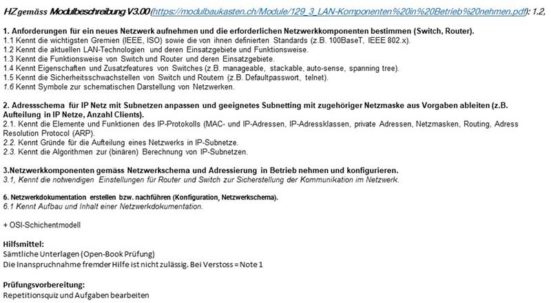

# Spickzettel – Modul 129_3 LAN-Komponenten in Betrieb nehmen

## Prüfungsinhalt

---

## 1. Neues Netzwerk planen & Komponenten bestimmen (Switch, Router)

### 1.1 Wichtige Gremien & Standards (IEEE, ISO)
- **ISO**: internationale Normungsorganisation (z. B. ISO/OSI-Modell)
- **IEEE**: definiert viele Netzstandards
  - **IEEE 802.x** = Familie von LAN-/WLAN-Standards  
    - 802.3 → Ethernet (z. B. 10/100/1000Base-T)  
    - 802.11 → WLAN  
- Beispiele Kabel-/Übertragungs-Standards:
  - **10Base-T** (10 Mbit/s, Twisted Pair)
  - **100Base-TX** (Fast Ethernet, 100 Mbit/s)
  - **1000Base-T** (Gigabit Ethernet)
  - **1000Base-SX/LX** (Glasfaser)

---

### 1.2 Aktuelle LAN-Technologien & Einsatz
- **Ethernet (802.3)**  
  - Kabel: Kupfer (Cat5e–Cat7), Glasfaser  
  - Einsatz: praktisch alle kabelgebundenen LANs
- **WLAN (802.11 a/b/g/n/ac/ax)**  
  - Einsatz: mobile Geräte, BYOD, Gäste
- **VLAN (Virtual LAN)**  
  - Logische Netztrennung auf Switch  
  - Sicherheit + Strukturierung

---

### 1.3 Funktionen von Switch & Router

**Switch (Layer 2):**
- Verbindet Endgeräte im **gleichen Netz**
- Arbeitet mit **MAC-Adressen**
- Lernfunktion: MAC-Adress-Tabelle
- Reduziert Kollisionen, vollduplex, hohe Bandbreite

**Router (Layer 3):**
- Verbindet **verschiedene IP-Netze**
- Arbeitet mit **IP-Adressen**
- Trifft Weiterleitungsentscheidungen anhand der **Routing-Tabelle**
- Standard Gateway für Clients

---

### 1.4 Eigenschaften & Zusatzfeatures von Switches
- **Manageable**: per Web/CLI konfigurierbar (VLAN, STP, Trunks, Monitoring)
- **Unmanaged**: Plug & Play, keine Konfiguration
- **Stackable**: mehrere Switches als Einheit betreibbar
- **Auto-MDI-X / Auto-Sense**: erkennt Kabeltyp (Crossover/straight), Geschwindigkeit, Duplex
- **Spanning Tree (STP/RSTP)**:
  - Verhindert **Loops** im Layer-2-Netz
  - Schaltet redundante Verbindungen bei Bedarf frei

---

### 1.5 Sicherheitsaspekte Switch/Router
- **Standardpasswörter ändern + starke Passwörter**
- Zugriff absichern:
  - Nur **SSH** statt Telnet
  - Management-Zugriff auf Admin-IP/VLAN einschränken
- **Firmware aktuell halten**
- **Konfiguration sichern** (Backup)
- Port-Security (MAC-Adressen begrenzen) auf Switches
- Unbenutzte Ports **deaktivieren**

---

### 1.6 Symbole in Netzwerkschemas
- **PC / Client**: Monitor/PC-Symbol
- **Switch**: Rechteck mit vielen Ports
- **Router**: Kreis mit zwei gekreuzten Pfeilen
- **Firewall**: Mauer/Schutzschild
- **Server**: Turm- oder Rack-Symbol
- **WLAN-AP**: Antenne mit Funkwellen

---

## 2. IP-Adressschema & Subnetting

### 2.1 Grundlagen MAC & IP

**MAC-Adresse (Layer 2):**
- 48 Bit, Hex-Format: `AA:BB:CC:DD:EE:FF`
- Weltweit (theoretisch) eindeutig
- Wird im lokalen Netz verwendet

**IP-Adresse (Layer 3):**
- IPv4: 32 Bit, z. B. `192.168.1.10`
- Aufteilung in **Netzwerkanteil** + **Hostanteil**
- Bestimmt durch **Subnetzmaske** oder **/CIDR** (z. B. /24)

---

### 2.2 IP-Adressklassen & private Bereiche (IPv4)

| Klasse | Bereich (historisch) | Typischer Start privater Bereich |
|--------|----------------------|----------------------------------|
| A | 0.0.0.0 – 127.255.255.255 | 10.0.0.0/8 |
| B | 128.0.0.0 – 191.255.255.255 | 172.16.0.0/12 |
| C | 192.0.0.0 – 223.255.255.255 | 192.168.0.0/16 |

**Private IPs**: nur intern nutzbar, werden im Internet **genattet**.

---

### 2.3 Netzmasken & CIDR

| CIDR | Maske | Hosts (≈) |
|------|-------|-----------|
| /24 | 255.255.255.0 | 254 |
| /25 | 255.255.255.128 | 126 |
| /26 | 255.255.255.192 | 62 |
| /27 | 255.255.255.224 | 30 |
| /30 | 255.255.255.252 | 2 (Router-Links) |

**Merke:**  
Mehr Bits im Netzanteil → **mehr Subnetze**, aber **weniger Hosts/Subnetz**.

---

### 2.4 Routing – kurze Wiederholung
- Router leiten Pakete **zwischen Netzen** weiter
- Wichtige Begriffe:
  - **Routing-Tabelle**: Liste möglicher Zielnetze
  - **Default Route**: „Alles andere → Gateway X“
  - **Static Route** vs. dynamische Protokolle (RIP, OSPF, BGP)

---

### 2.5 ARP (Address Resolution Protocol)
- Aufgabe: **IP → MAC** auflösen
- Ablauf:
  1. Host sendet ARP-Broadcast: „Wer hat IP X?“
  2. Ziel antwortet mit seiner MAC
  3. Eintrag landet im ARP-Cache
- Ohne ARP keine IPv4-Kommunikation im LAN

---

### 2.6 IP-Subnetze planen & zeichnen

**Vorgehen:**
1. Anzahl benötigter Hosts/Subnetze bestimmen  
2. Passende Maske wählen (`/24`, `/25`, `/26`, …)  
3. Netzaddressen in **Blockgröße** hochzählen  
4. Für jedes Subnetz notieren:
   - Netzwerkadresse
   - Hostbereich
   - Broadcastadresse

**Beispiel `/26` (Blockgröße 64):**
- 192.168.0.0 – 192.168.0.63
- 192.168.0.64 – 192.168.0.127
- 192.168.0.128 – 192.168.0.191
- 192.168.0.192 – 192.168.0.255

---

### 2.7 IP-Adressen zuweisen

Pro Subnetz:
- **Netzwerkadresse** → nicht belegbar  
- **Broadcastadresse** → nicht belegbar  
- Hostadressen **dazwischen** → Clients, Server, Router

Merke:
- Router-Gateway-IP pro Subnetz sinnvoll standardisieren  
  - z. B. immer `.1` oder `.254` für Gateway

---

## 3. Netzwerkkomponenten installieren & konfigurieren

### 3.1 Vorbereitung & Grundkonfiguration

**Physisch:**
- Geräte platzieren & verkabeln:
  - Patchpanel → Switch  
  - Switch → Router  
  - Switch → Endgeräte  
- Auf richtige Kabeltypen achten:
  - Kupfer (Cat5e/6/7), Glasfaser (SM/MM)
- Link/Status-LEDs prüfen

**Grundkonfiguration (CLI/Web):**
- Admin-Zugang setzen (Passwort/Benutzer)
- Hostname einrichten
- Management-IP definieren (z. B. im Mgmt-VLAN)
- Zeitsynchronisation (NTP) einstellen (optional, aber sinnvoll)

---

### 3.2 Konfiguration nach Netzwerkschema

Beispiele je nach Aufgabe:
- **Switch:**
  - VLANs anlegen, Ports zuweisen
  - Trunk-Ports zwischen Switches/Router konfigurieren
  - ggf. Port-Security & STP aktivieren/prüfen
- **Router:**
  - IP-Adressen und Subnetze für alle Interfaces setzen
  - Default-Route + evtl. statische Routen konfigurieren
  - DHCP-Server (falls vom Router) konfigurieren
  - NAT einrichten (für Internetzugang)

---

### 3.3 Inbetriebnahme & Test

**Basis-Tests:**
- `ping` innerhalb eines Subnetzes (Client ↔ Gateway)
- `ping` zwischen Subnetzen (Routing prüfen)
- `tracert` / `traceroute` zur Pfadanalyse
- Prüfen, ob:
  - richtige IP, Maske, Gateway, DNS konfiguriert sind
  - VLANs korrekt zugeordnet sind

**Dokumentation:**
- IP-Plan aktuell halten (Tabelle mit Geräten/IPs/Subnetzen)
- Konfigurationen sichern (Backup vom Switch/Router)

---

## OSI-Schichtenmodell (Kurz-Spick)

| Nr. | Schicht | Stichworte | Beispiel |
|-----|---------|------------|----------|
| 7 | Anwendung | Protokolle für Apps | HTTP, DNS, FTP |
| 6 | Darstellung | Format, Verschlüsselung | TLS, JPEG |
| 5 | Sitzung | Verbindungen verwalten | Sitzung/Session |
| 4 | Transport | Portnummern, Zuverlässigkeit | TCP, UDP |
| 3 | Vermittlung | IP, Routing | IP, ICMP, Router |
| 2 | Sicherung | MAC, Frames | Switch, MAC, VLAN |
| 1 | Bitübertragung | Bits, Signale, Kabel | Kabel, WLAN-Funksignal |

**Merksatz (oben → unten):**  
> All People Seem To Need Data Processing  

**Merksatz (unten → oben):**  
> Please Do Not Throw Sausage Pizza Away  

---

## Super-kurze Zusammenfassungen (Ultra-Spick)

- **Switch** = MAC, Layer 2, verbindet Geräte im selben Netz  
- **Router** = IP, Layer 3, verbindet verschiedene Netze  
- **VLAN** = logische Netze auf einem Switch  
- **Subnetting** = großes Netz in kleinere Netze teilen  
- **Gateway** = IP des Routers im jeweiligen Subnetz  
- **DNS** = Namen → IP  
- **DHCP** = verteilt IP-Adressen automatisch  
- **ARP** = IP → MAC im LAN  

