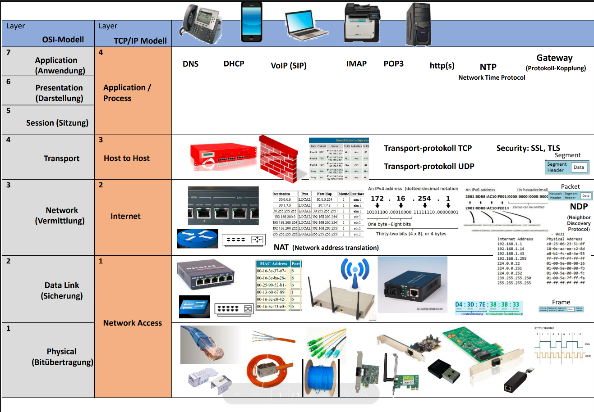

# OSI-Modell

**Links**

**Übungen in Teams**
Repetition OSI-Modell - Quiz

## Einführung
Das **OSI-Modell (Open Systems Interconnection)** ist ein Referenzmodell, das die Netzwerkkommunikation in **7 Schichten** unterteilt.  
Jede Schicht hat klar definierte Aufgaben und ermöglicht standardisierte Kommunikation zwischen Geräten und Herstellern.

---

## Die 7 Schichten des OSI-Modells

### **1. Bitübertragungsschicht (Physical Layer)**
- Überträgt **Bits** über ein physisches Medium
- Definiert Stecker, Kabel, elektrische Signale
- Beispiele:
  - Ethernet-Kabel
  - Glasfaser
  - WLAN-Frequenzen

---

### **2. Sicherungsschicht (Data Link Layer)**
- Organisiert die **rahmenbasierte Übertragung** innerhalb eines LAN
- Adressierung über **MAC-Adressen**
- Fehlererkennung (CRC)
- Beispiele:
  - Switches
  - ARP
  - MAC-Adress-Tabellen

---

### **3. Vermittlungsschicht (Network Layer)**
- Verantwortlich für **Routing** zwischen Netzwerken
- Arbeitet mit **IP-Adressen**
- Bestimmt den besten Weg zum Ziel
- Beispiele:
  - Router
  - IPv4 / IPv6
  - ICMP (Ping)

---

### **4. Transportschicht (Transport Layer)**
- Stellt zuverlässige oder schnelle Datenübertragung sicher
- Segmentierung der Daten
- Wichtige Protokolle:
  - **TCP** – zuverlässig (z. B. Webseiten, E-Mails)
  - **UDP** – schnell, aber ohne Garantie (z. B. Spiele, Streaming)

---

### **5. Sitzungsschicht (Session Layer)**
- Aufbau und Verwaltung von Sitzungen/Verbindungen
- Hält Kommunikation offen und überwacht sie
- Beispiele:
  - Sitzungsverwaltung in Anwendungen
  - RPC (Remote Procedure Call)

---

### **6. Darstellungsschicht (Presentation Layer)**
- Übersetzt Daten in ein Format, das beide Seiten verstehen
- Verschlüsselung & Kompression
- Beispiele:
  - TLS/SSL
  - JPEG, PNG
  - ASCII, UTF-8

---

### **7. Anwendungsschicht (Application Layer)**
- Bietet direkte Schnittstellen für Anwendungen
- Hier arbeiten die bekannten Protokolle, nicht die Programme selbst
- Beispiele:
  - HTTP/HTTPS
  - DNS
  - FTP
  - SMTP

---

## Merksprüche für die Reihenfolge
Von unten nach oben:
- **"Please Do Not Throw Sausage Pizza Away"**

Von oben nach unten:
- **"All People Seem To Need Data Processing"**

---

## OSI vs. TCP/IP-Modell (Kurzvergleich)

| OSI-Schicht | TCP/IP-Schicht |
|-------------|-----------------|
| Anwendung (7) | Application |
| Darstellung (6) | Application |
| Sitzung (5) | Application |
| Transport (4) | Transport |
| Vermittlung (3) | Internet |
| Sicherung (2) | Network Access |
| Bitübertragung (1) | Network Access |

Das OSI-Modell dient als **Theoriemodell**, während TCP/IP in der Praxis implementiert ist.

---

## Zusammenfassung
Das OSI-Modell:
- standardisiert Kommunikation
- trennt Funktionen in logische Ebenen
- erleichtert Fehlersuche (z. B. „Layer 1 Problem“ = Kabel defekt)
- ist Grundlage für alle Netzwerktechnologien

Das 7-Schichten-Modell ist
